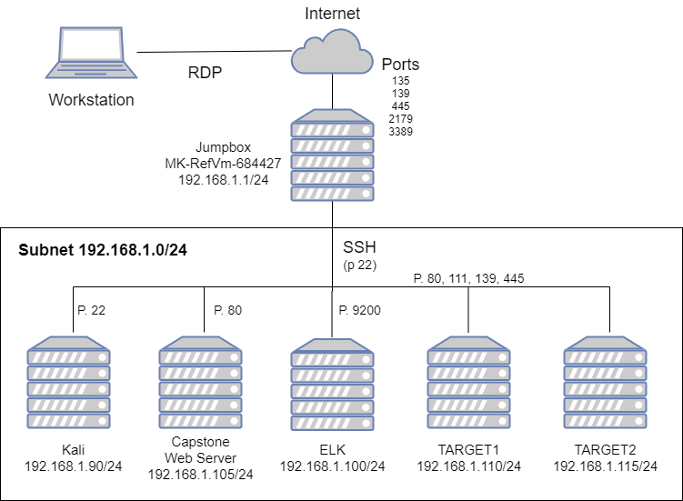

## Defensive Security 

The files in this repository were used to assess the network depicted below for vulnerbilities on a target machine, and utilising an ELK server to monitor logs and create alerts, and applying patches with ansible.




This deployment will concentrate on the **TARGET1** machine.

***
### Description of the Topology

This network contains a jump box provisioner, three web servers with critical vulnerabilities, an ELK server, and a Kali Linux VM for testing the web servers.

Integrating an ELK server allows users to easily monitor the vulnerable VMs for changes to the services and system logs, whilst also monitoring incoming and outgoing network traffic.

- Filebeat watches for system log changes.
- Metricbeat records services running on the server.
- Packetbeat monitors network traffic logs.

The configuration details of each machine may be found below.

| Name            | Function      | IP Address    | Operating System |
|-----------------|---------------|---------------|------------------|
| Hyper-V Jumpbox | Gateway       | 192.168.1.1   | Linux            |
| Kali            | Attack Server | 192.168.1.90  | Linux            |
| ELK             | ELK Server    | 192.168.1.100 | Linux            |
| Capstone        | Web Server    | 192.168.1.105 | Linux            |
| TARGET1         | Web Server    | 192.168.1.110 | Linux            |
| TARGET2         | Web Server    | 192.168.1.115 | Linux            |


***
### Files

These files have been tested and used to patch the vulnerabilities on the target machine.

  - patches.yml
***

### Vulnerability Scans

The following scans were used to discover the critical vulnerabilities.
``` bash
$ nmap -O -sV 192.168.1.110
  ```
``` bash
$ wpscan --url http://192.168.1.110/wordpress --enumerate vp,u
```

***
### Critical Vulnerabilities

The following critical vulnerabilities were found on the **TARGET1** machine:

- Open ports and vulnerable services
- Wordpress vulnerabilities
- MySQL vulnerabilities
- Weak password policy

***
### ELK Server, Target Machines & Beats
This ELK server is configured to monitor the following machines:
- 192.168.1.105
- 192.168.1.110
- 192.168.1.115

The following Beats are in stalled on these machines:
- Filebeats
- Metricbeats
- Packetbeats

 These Beats allow us to collect the following information from each machine:
- Filebeat collects data about the file system, such as audit logs, server logs, gc logs, deprecation logs and slow logs, and sends the information to Elasticsearch. 

- Metricbeat collects metrics from the system and services running on the server, such as MySql, Nginx, System, Apache etc and sends the data to Elasticsearch.

- Packetbeat is a real-time network packet analyser monitoring the incoming and outgoing traffic for any suspicious activity.

***
### Patching Using the Playbook
In order to use the playbook, you will need to have an Ansible control node already configured. Assuming you have such a control node provisioned: 

SSH into the control node and follow the steps below:
- Copy the [patches.yml](ansible/install-elk.yml) playbook file to `/etc/ansible/` .
- Update the `/etc/ansible/patches.yml` file to include the elk server host.
- Run the playbook, and navigate to `http://[your.elk.server.public.ip]:5601/app/kibana` to check that the installation worked as expected.

***
### Installing ELK - Specific Commands


- Download the install-elk.yml playbook with the following command from your ansible container:
    ``` bash
     $ curl https://raw.githubusercontent.com/dno-cs/scripts/main/ansible/install-elk.yml > /etc/ansible/install-elk.yml
    ```

 - Edit the hosts file:
    ``` bash
      $ nano /etc/ansible/hosts
    ```
   - Add the following lines to the hosts file:
    ```bash
      [elkservers]
      10.1.0.4 ansible_python_interpreter=/usr/bin/python3 
    ```
 - Run the playbook to install ELK on the ELK server:
    ``` bash
      $ ansible-playbook install-elk.yml
    ```

 - Navigate to the ELK server to confirm ELK is up and running.

***
### Installing Beats - Specific Commands

- Download the filebeat-config.yml and metricbeat-config.yml playbooks to `/etc/ansible/files` with the following command from your ansible container:
  ``` bash
  $ curl https://raw.githubusercontent.com/dno-cs/scripts/main/ansible/filebeat-config.yml > /etc/ansible/files/filebeat-config.yml

  $ curl https://raw.githubusercontent.com/dno-cs/scripts/main/ansible/metricbeat-config.yml > /etc/ansible/files/metricbeat-config.yml
  ```
- Edit the configuration files:

  **NOTE**: Do NOT remove or edit the port numbers. 
  
  Filebeat-config.yml
    ``` bash
      $ nano /etc/ansible/file/filebeat-config.yaml
    ```
   - Edit lines 1105 and 1806 and replace the IP address with the private IP address of your ELK server.:
    ```bash
         hosts: ["10.1.0.4:9200"]     #line 1105
         host: "10.1.0.4:5601"        #line 1806
    ```
  metricbeat-config.yml
    ``` bash
      $ nano /etc/ansible/file/metricbeat-config.yaml
    ```
   - Edit lines 62 and 95 and replace the IP address with the private IP address of your ELK server.:
    ```bash
          host: "10.1.0.4:5601"     #line 62
          host: "10.1.0.4:9200"     #line 95
    ```
- Download the filebeat-playbook.yml and metricbeat-playbook.yml playbooks to `/etc/ansible/` with the following command from your ansible container:
  ``` bash
  $ curl https://raw.githubusercontent.com/dno-cs/scripts/main/ansible/filebeat-playbook.yml > /etc/ansible/filebeat-playbook.yml

  $ curl https://raw.githubusercontent.com/dno-cs/scripts/main/ansible/metricbeat-playbook.yml > /etc/ansible/metricbeat-playbook.yml
  ```
 - Run the playbooks to install beat on the web servers:
    ``` bash
      $ ansible-playbook filebeat-playbook.yml
      $ ansible-playbook metricbeat-playbook.yml    
    ```
 - Navigate to the ELK server to confirm data is being retrieved from the webservers.